# RazCodePay — AI Revenue Recovery Platform

**Razorpay AI Buildathon · Track 03**

> **AI recommends. Policy controls. Executor acts. Razorpay verifies.**

RazCodePay is an AI-assisted revenue recovery control plane for merchants using Razorpay. It turns a payment failure into an auditable workflow that identifies recovery opportunity, explains risk, recommends a bounded next action, executes only within merchant-defined controls, and credits recovered revenue only after a verified Razorpay success event.

## The problem

A failed payment does not necessarily mean lost revenue. The merchant still needs to decide whether recovery is worthwhile, what intervention fits the failure, when the customer can be contacted, and whether the intervention actually produced a successful payment.

RazCodePay turns that decision chain into one controlled loop:

```text
detect → diagnose → predict → decide → policy-check → execute → verify
```

## What we built

### Merchant workspace

- Registration and login with JWT-based authentication.
- `owner`, `admin`, `operator`, and `viewer` roles.
- Merchant-scoped MongoDB data.
- Command Center, Recovery Cases, Decision Intelligence, Policy & Controls, Operations, and account/profile controls.
- Profile menu with merchant identity, Razorpay connection status, and sign-out.

### Razorpay integration

- Merchant-controlled Razorpay API-key connection for Test Mode.
- Provider credentials encrypted with AES-256-GCM before persistence.
- Merchant-specific webhook endpoint.
- Raw-body HMAC-SHA256 webhook verification.
- Provider event de-duplication with deterministic fallback hashing.
- Real Razorpay Payment Link creation for eligible cases.
- Recovery attribution based on provider-confirmed success rather than predictions or attempted actions.

### AI and decision intelligence

- Deterministic, interpretable `local-recovery-v2` model.
- Recoverability, risk, confidence, uncertainty, data quality, and expected recovery opportunity.
- Feature-level signals for operator explanation.
- Expected-value ranking to prioritize cases.
- Optional OpenAI reasoning constrained to the action set already approved by merchant policy.
- Deterministic fallback when LLM output is unavailable or invalid.

### Guardrails and operations

- Recovery window and grace period.
- Quiet hours.
- Maximum attempts per case.
- Automatic-contact cap.
- Human-review threshold.
- Consent and channel checks.
- Execution-time policy re-check.
- Idempotent actions and duplicate-event handling.
- Audit events, communication history, experiments, recovery outcomes, retries, and queue health.

**MongoDB is the application system of record. Redis/BullMQ is queue infrastructure only.**

## End-to-end architecture

```mermaid
flowchart LR
    RP[Razorpay] -->|signed webhook| WH[Webhook Gateway]
    WH --> VERIFY[HMAC + Deduplication]
    VERIFY --> DB[(MongoDB\nSystem of Record)]
    DB --> CASE[Recovery Case]

    CASE --> MODEL[local-recovery-v2]
    MODEL --> DECIDE[Bounded Decision Engine]
    POLICY[Merchant Policy] --> DECIDE
    DECIDE --> RECHECK[Execution-time Policy Re-check]
    RECHECK --> EXEC[Recovery Executor]
    EXEC --> RPAPI[Razorpay API]
    EXEC --> MAIL[SMTP / Recovery Communication]

    RP -->|verified success| VERIFY2[Recovery Verification]
    VERIFY2 --> DB

    UI[React + Vite\nMerchant Console] --> AUTH[JWT + RBAC]
    AUTH --> API[Express API]
    API --> DB
    API <--> Q[Redis + BullMQ]
    Q --> WORKER[Recovery Worker]
    WORKER --> DB

    MODEL -. optional reasoning .-> LLM[Optional LLM]
    LLM -. approved actions only .-> DECIDE
```



## Core recovery flow

1. Razorpay emits a failure event.
2. RazCodePay verifies the merchant-specific webhook signature and de-duplicates the event.
3. The verified event creates or updates a recovery case in MongoDB.
4. `local-recovery-v2` scores risk, recoverability, confidence, uncertainty, data quality, and expected recovery opportunity.
5. Merchant policy removes actions that are not allowed.
6. The decision engine chooses one bounded action. Optional LLM reasoning may refine the action/explanation only inside that approved set.
7. The executor reloads the current case and re-checks policy immediately before a side effect.
8. An eligible case may create a Razorpay Payment Link or send a configured recovery communication.
9. A later verified Razorpay success event is required before the case becomes `recovered` and recovered amount is attributed.

## Case lifecycle

```text
DETECTED
   ↓
ENRICHED
   ↓
AWAITING_WINDOW
   ↓
PLANNED
   ↓
EXECUTING
   ↓
MONITORING ───────► RECOVERED
   │
   ├───────────────► STOPPED
   └───────────────► EXPIRED
```

`recovered` is a provider-confirmed state. A model prediction, email, or created Payment Link is not itself a recovery event.

## Technology stack

| Layer | Technology | Role |
|---|---|---|
| Web | React + Vite | Merchant console and operator workflow |
| API | Node.js + Express | Authentication, orchestration and provider integration |
| Database | MongoDB + Mongoose | Durable application state |
| Queue | Redis + BullMQ | Delayed work, retries and worker execution |
| AI | `local-recovery-v2` + optional OpenAI | Recovery scoring and bounded reasoning |
| Provider | Razorpay REST API + webhooks | Payment action and monetary truth |
| Email | Nodemailer / SMTP | Recovery communication |

## Local setup — Windows, no Docker

RazCodePay does not require Docker for the current buildathon workflow.

Start a local MongoDB instance and a Redis-compatible service such as Memurai.

Expected services:

```text
MongoDB  →  127.0.0.1:27017
Redis    →  127.0.0.1:6379
API      →  127.0.0.1:3000
Web      →  127.0.0.1:5173
```

### API

```powershell
cd server
npm install
copy .env.example .env
npm run dev
```

### Worker

```powershell
cd server
npm run worker
```

### Web console

```powershell
cd web
npm install
npm run dev
```

Health check:

```text
GET http://127.0.0.1:3000/api/health
```

## Environment

For production-oriented mode:

```env
DEMO_MODE=false
MONGODB_URI=mongodb://127.0.0.1:27017/razcodepay
REDIS_URL=redis://127.0.0.1:6379
JWT_SECRET=<long-random-secret>
ENCRYPTION_KEY=<secret-key-material>
ALLOWED_ORIGIN=http://127.0.0.1:5173
AI_API_KEY=<optional>
AI_MODEL=gpt-4o-mini
```

SMTP is optional. See [`docs/PRODUCTION.md`](./docs/PRODUCTION.md) for the full configuration boundary.

**Never commit `.env`, API keys, webhook secrets, JWT secrets, encryption keys, SMTP passwords, or LLM provider secrets.**

## Razorpay Test Mode demo

The intended judge demo uses Razorpay Test Mode:

```text
Login
  ↓
Merchant workspace
  ↓
Razorpay Test Mode connection
  ↓
Failed test payment
  ↓
payment.failed webhook
  ↓
Signature verification + deduplication
  ↓
MongoDB recovery case
  ↓
local-recovery-v2
  ↓
Policy-bounded recommendation
  ↓
Eligible recovery action
  ↓
Verified Razorpay success
  ↓
Recovered outcome
```

Webhook route:

```text
POST https://<public-host>/api/webhooks/razorpay/<merchant-id>
```

For the current buildathon workflow, a merchant-controlled API-key connection is the practical Test Mode integration path. OAuth support is retained for a future provider-approved multi-merchant onboarding model.

## Demo mode vs production-oriented mode

| Capability | `DEMO_MODE=true` | `DEMO_MODE=false` |
|---|---|---|
| Authentication | Synthetic demo workspace | JWT + RBAC required |
| Data | Synthetic recovery data | Merchant-scoped MongoDB data |
| Provider credentials | Not required | Encrypted merchant connection |
| Provider API calls | Disabled | Available when configured |
| Success simulation | Available | Blocked |
| Demo reset | Available | Blocked |
| Signed webhooks | Not required for synthetic demo | Required for provider events |

## API and deeper documentation

- [`architecture.md`](./architecture.md) — system design, trust boundaries and lifecycle.
- [`docs/AI.md`](./docs/AI.md) — model, signals, decision logic and LLM boundary.
- [`docs/API.md`](./docs/API.md) — endpoint reference and security invariants.
- [`docs/PHASE2.md`](./docs/PHASE2.md) — queue, communication, experiments and operational capabilities.
- [`docs/SECURITY.md`](./docs/SECURITY.md) — security and trust model.
- [`docs/PRODUCTION.md`](./docs/PRODUCTION.md) — deployment and Live Mode hardening boundary.
- [`docs/DEMO_SCRIPT.md`](./docs/DEMO_SCRIPT.md) — final judge recording flow.
- [`docs/FINAL_SUBMISSION.md`](./docs/FINAL_SUBMISSION.md) — final review checklist.

## Repository map

```text
RazCodePay/
├── README.md
├── architecture.md
├── docs/
│   ├── AI.md
│   ├── API.md
│   ├── DEMO_SCRIPT.md
│   ├── FINAL_SUBMISSION.md
│   ├── PHASE2.md
│   ├── PRODUCTION.md
│   └── SECURITY.md
├── ml/
├── server/
│   ├── src/
│   │   ├── ai/
│   │   ├── models/
│   │   ├── routes/
│   │   ├── services/
│   │   ├── store.js
│   │   └── server.js
│   └── test/
└── web/
    └── src/
```

## Submission boundary

This repository demonstrates a complete, provider-grounded recovery control plane in local and Razorpay Test Mode environments. It is **production-oriented**, not presented as an already-operated public Live Mode SaaS.

For public Live Mode, remaining work includes managed infrastructure, backups, centralized observability, secret rotation, formal security testing, messaging delivery/bounce handling, production model calibration, operational runbooks, and any Razorpay Technology Partner/OAuth onboarding required for the intended multi-merchant model.