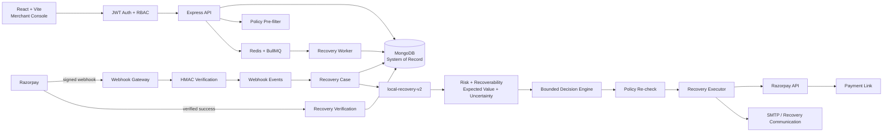

# RazCodePay — AI Revenue Recovery Platform

**Razorpay AI Buildathon · Track 03**

RazCodePay is an AI-assisted revenue recovery control plane for merchants using Razorpay. It detects payment failures, scores recovery potential, estimates expected recovery value, recommends a bounded next action, executes only inside deterministic merchant controls, and credits recovered revenue only after verified provider success.

> **AI recommends. Policy controls. Executor acts. Razorpay verifies.**

## Why RazCodePay

Payment failure is not the end of a transaction. A merchant still needs to decide whether a case is worth recovering, what intervention is appropriate, when it is safe to contact the customer, and whether the intervention actually recovered money.

RazCodePay turns that sequence into an auditable workflow:

```text
detect → diagnose → predict → decide → policy-check → execute → verify
```

## What is implemented

### Merchant platform
- Merchant registration and login in production mode.
- JWT-based authenticated sessions with owner/admin/operator/viewer roles.
- Merchant-scoped application data in MongoDB.
- Merchant profile menu with account visibility and sign-out.

### Razorpay integration
- Merchant-owned Razorpay API-key connection for Test Mode and controlled deployments.
- Encrypted provider credentials using AES-256-GCM before MongoDB storage.
- Merchant-specific webhook endpoint.
- HMAC-SHA256 webhook verification over the raw request body.
- Event de-duplication using the Razorpay event ID when available, with deterministic fallback hashing.
- Real Razorpay Payment Link creation for eligible cases.
- Provider-grounded recovery attribution: an AI decision, email, or Payment Link does **not** count as recovered revenue on its own.

### AI and decisioning
- Deterministic, interpretable `local-recovery-v2` scoring model.
- Recovery, risk, confidence, uncertainty, data-quality and expected-recovery-value outputs.
- Feature-level signals for judge/operator explainability.
- Expected-value prioritization instead of amount-only ranking.
- Optional OpenAI reasoning over a policy-approved action set.
- Invalid or unavailable LLM output falls back to deterministic local decisioning.

### Safety and operations
- Deterministic merchant guardrails for recovery window, quiet hours, grace period, attempt limits, contact caps and human-review thresholds.
- Policy checked before planning and re-checked immediately before execution.
- Idempotent recovery actions and duplicate-event handling.
- Audit events, communication history and recovery outcomes.
- Redis/BullMQ for asynchronous jobs only; MongoDB remains the application system of record.
- Safe demo mode with synthetic data and no provider side effects.

## Architecture



### Core data flow

1. Razorpay emits a payment event.
2. The webhook gateway validates the merchant-specific signature and de-duplicates the event.
3. A recovery case is created or updated in MongoDB.
4. The local recovery model computes interpretable signals and expected recovery value.
5. Deterministic policy removes disallowed actions.
6. The decision engine selects one bounded action; optional LLM reasoning can refine the explanation/action within the already-approved set.
7. The executor re-checks current policy immediately before any side effect.
8. A Payment Link or configured recovery communication may be issued.
9. A later verified Razorpay success event is required before the case becomes `recovered` and recovered amount is attributed.

## Technology stack

| Layer | Technology | Responsibility |
|---|---|---|
| Web | React + Vite | Merchant command center and operator workflows |
| API | Node.js + Express | Auth, cases, policy, AI orchestration and provider integration |
| Database | MongoDB + Mongoose | System of record |
| Queue | Redis + BullMQ | Background recovery jobs, retries and delayed work |
| AI | local-recovery-v2 + optional OpenAI | Recovery scoring and bounded reasoning |
| Provider | Razorpay REST API + webhooks | Payment actions and monetary truth |
| Email | Nodemailer / SMTP | Recovery communication |

## Local development (Windows, no Docker)

RazCodePay does **not** require Docker.

Install MongoDB Community Server and a Redis-compatible service such as Memurai. Start both locally.

Expected local addresses:

```text
MongoDB  →  127.0.0.1:27017
Redis    →  127.0.0.1:6379
API      →  127.0.0.1:3000
Web      →  127.0.0.1:5173
```

### Terminal 1 — API

```powershell
cd server
npm install
copy .env.example .env
npm run dev
```

### Terminal 2 — worker

```powershell
cd server
npm run worker
```

### Terminal 3 — web console

```powershell
cd web
npm install
npm run dev
```

Health check:

```text
GET http://127.0.0.1:3000/api/health
```

## Environment

Production-oriented mode uses:

```env
DEMO_MODE=false
MONGODB_URI=mongodb://127.0.0.1:27017/razcodepay
REDIS_URL=redis://127.0.0.1:6379
JWT_SECRET=<long-random-secret>
ENCRYPTION_KEY=<long-random-secret>
ALLOWED_ORIGIN=http://127.0.0.1:5173
AI_API_KEY=<optional>
AI_MODEL=gpt-4o-mini
```

For SMTP-backed recovery email, configure the SMTP variables documented in [`docs/PRODUCTION.md`](./docs/PRODUCTION.md).

**Never commit `.env` files, API keys, webhook secrets, JWT secrets, encryption keys or SMTP passwords.**

## Razorpay Test Mode workflow

For the hackathon demo, use Razorpay Test Mode:

```text
Razorpay Test Payment
        ↓
payment.failed webhook
        ↓
Signature verification + deduplication
        ↓
MongoDB recovery case
        ↓
local-recovery-v2 scoring
        ↓
Policy-bounded recommendation
        ↓
Razorpay Payment Link / recovery communication
        ↓
Verified Razorpay success event
        ↓
Recovered case + attributed amount
```

The webhook endpoint is merchant-specific:

```text
POST https://<public-host>/api/webhooks/razorpay/<merchant-id>
```

## Demo mode vs production-oriented mode

### `DEMO_MODE=true`

- Synthetic cases can be loaded.
- Authentication is bypassed for the demo workspace.
- No provider credentials are required.
- No live provider API calls are performed.
- The demo success simulator can illustrate the recovery state transition.

### `DEMO_MODE=false`

- MongoDB is required.
- Authentication and role checks are enforced.
- Merchant data is scoped to the authenticated workspace.
- Provider credentials are encrypted at rest.
- Signed Razorpay webhooks are required for provider events.
- Synthetic reset/success endpoints are disabled.
- Real provider actions are available where configured.

## API surface

| Method | Endpoint | Purpose |
|---|---|---|
| POST | `/api/auth/register` | Create merchant workspace and owner |
| POST | `/api/auth/login` | Authenticate merchant user |
| GET | `/api/auth/me` | Return authenticated identity |
| GET | `/api/dashboard` | KPIs, visible cases and active policy |
| GET | `/api/cases` | Recovery queue |
| GET | `/api/cases/:id` | Case detail |
| POST | `/api/cases/:id/evaluate` | Run policy + AI evaluation |
| POST | `/api/cases/:id/execute` | Execute bounded recovery action |
| POST | `/api/cases/:id/stop` | Stop future automation |
| GET | `/api/policy` | Read merchant guardrails |
| PUT | `/api/policy` | Update merchant guardrails |
| GET | `/api/audit` | Audit events |
| GET | `/api/merchant` | Merchant profile data |
| GET | `/api/integrations/razorpay` | Connection status |
| POST | `/api/integrations/razorpay` | Connect/verify Razorpay |
| DELETE | `/api/integrations/razorpay` | Revoke connection |
| POST | `/api/webhooks/razorpay/:merchantId` | Receive signed Razorpay events |
| GET | `/api/phase2/queue` | Queue health |
| GET | `/api/phase2/experiments` | List experiments |
| POST | `/api/phase2/experiments` | Create experiment |
| GET | `/api/phase2/experiments/metrics` | Experiment outcome metrics |
| GET | `/api/phase2/cases/:caseId/communications` | Communication audit |
| POST | `/api/cases/:id/simulate-success` | Demo-only recovery simulation |
| POST | `/api/demo/reset` | Demo-only synthetic cohort reset |

## Repository map

```text
RazCodePay/
├── README.md
├── architecture.md
├── docs/
│   ├── AI.md
│   ├── API.md
│   ├── DEMO_SCRIPT.md
│   ├── FINAL_SUBMISSION.md
│   ├── PHASE2.md
│   ├── PRODUCTION.md
│   └── SECURITY.md
├── ml/
├── server/
│   ├── src/
│   │   ├── ai/
│   │   ├── models/
│   │   ├── routes/
│   │   ├── services/
│   │   ├── store.js
│   │   └── server.js
│   └── test/
└── web/
    └── src/
```

## Submission-ready boundary

This repository is designed to demonstrate a complete, provider-grounded recovery workflow in Razorpay Test Mode. It is **production-oriented**, not presented as a fully operated public SaaS.

Before a public Live Mode launch, the remaining work includes managed infrastructure, backups, centralized observability, secret rotation, security testing, messaging-provider delivery/bounce handling, stronger model calibration from production outcomes, and completion of any Razorpay Technology Partner/OAuth onboarding required for the intended multi-merchant operating model.

## Judge starting points

- **Architecture:** [`architecture.md`](./architecture.md)
- **AI design:** [`docs/AI.md`](./docs/AI.md)
- **API reference:** [`docs/API.md`](./docs/API.md)
- **Demo script:** [`docs/DEMO_SCRIPT.md`](./docs/DEMO_SCRIPT.md)
- **Phase 2 capabilities:** [`docs/PHASE2.md`](./docs/PHASE2.md)
- **Deployment/security boundary:** [`docs/PRODUCTION.md`](./docs/PRODUCTION.md) and [`docs/SECURITY.md`](./docs/SECURITY.md)
- **Final submission checklist:** [`docs/FINAL_SUBMISSION.md`](./docs/FINAL_SUBMISSION.md)
