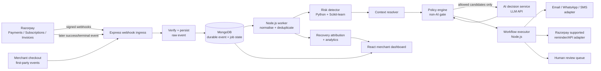
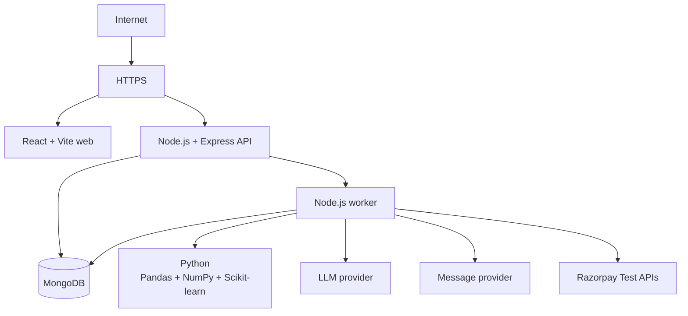
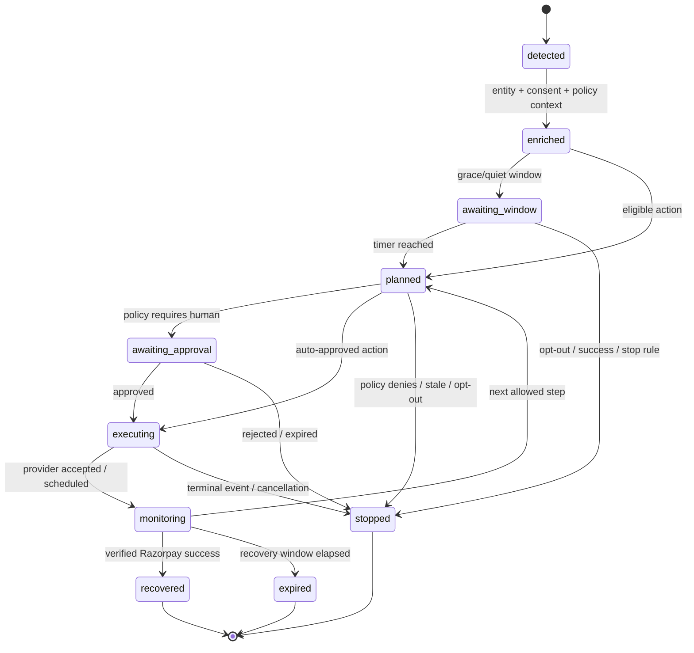
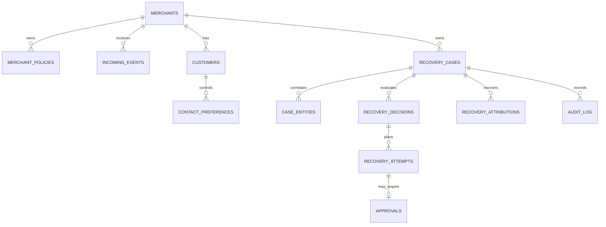

# RazCodePay — System Architecture and Implementation Plan

> **Buildathon track:** 03 — AI Revenue Recovery  
> **Product thesis:** Detect revenue at risk from Razorpay payment signals, decide the least intrusive helpful intervention, run only a merchant-approved recovery workflow, and prove the recovered amount with an immutable audit trail.

## 1. What we are building

RazCodePay is an AI-assisted recovery control plane for a merchant that uses Razorpay. It is **not** a payment gateway, collection agency, or autonomous money-moving system. Razorpay remains the system that creates, authorises, and confirms payment. RazCodePay turns failure and non-payment signals into carefully bounded recovery cases.

The first shippable version focuses on two high-signal recovery loops:

1. **Failed subscription payment:** a Razorpay payment failure or a subscription entering `pending` creates a case. The system diagnoses the reason, chooses an approved retry/reminder path, contacts the customer through an opted-in channel, and stops immediately when Razorpay reports a successful charge.
2. **Overdue invoice:** an issued invoice remains unpaid past the merchant's grace period. The system schedules compliant reminders, can ask Razorpay to resend the existing invoice, and escalates to a human only under merchant-set rules.

`checkout_abandoned` is included as the next workflow. It is activated only after the merchant sends first-party checkout lifecycle events and has the required consent for recovery messages.

This scope satisfies the Track 03 loop: **detect → diagnose → choose → execute a bounded intervention → measure recovered money**. Razorpay's Buildathon explicitly asks for a recovery workflow that has compliant escalation, stopping rules, an audit trail, and measured money recovered across a batch—not merely a dashboard of at-risk revenue. [Track brief](https://razorpay.com/buildathon/)

### 1.1 Product outcomes

| Outcome | Definition | Evidence shown in the demo |
| --- | --- | --- |
| Revenue at risk found | A failed subscription, overdue invoice, or abandoned checkout becomes a deduplicated case. | Event/case timeline and batch funnel. |
| Right intervention selected | The recommendation fits the failure reason, customer history, merchant policy, and contact consent. | Decision explanation and policy checks. |
| Recovery executed safely | A permitted reminder/link/retry workflow is sent exactly once per scheduled attempt. | Attempt record, provider response, idempotency key. |
| Revenue genuinely recovered | A later Razorpay success event is correlated to the original case. | Payment ID, recovered amount, attribution window. |
| Harm prevented | Opt-out, quiet hours, caps, success, expiry, or manual stop closes scheduled work. | Stopping-rule audit entries. |

### 1.2 Technology stack

The implementation is intentionally centered on the team's existing strengths. No framework is introduced unless it provides a clear benefit to the Track 3 workflow.

| Layer | Technology | Purpose |
| --- | --- | --- |
| Frontend | **React.js, HTML, CSS** | Merchant dashboard, case timeline, policy controls, approval queue, recovery metrics. |
| Frontend tooling | **Vite** | Fast local development/build for the React application. |
| Backend/API | **Node.js + Express.js** | REST APIs, Razorpay webhook ingress, authentication, policy/case endpoints. |
| Worker/orchestration | **Node.js** | Event processing, scheduled recovery attempts, stopping-rule checks, idempotency, audit writes. |
| Database | **MongoDB** | Event log, recovery cases, attempts, policies, audit trail, attribution and demo data. |
| AI/ML | **Python, Pandas, NumPy, Scikit-learn** | Revenue-risk/recoverability scoring, batch analysis and feature generation. |
| AI reasoning | **LLM API** | Selects/ranks only policy-approved interventions and returns structured recommendations. |
| Payment platform | **Razorpay Test APIs + Webhooks** | Source of truth for payment state and verified recovery. |
| Visualization | **React charts + Matplotlib** | Merchant metrics and offline/batch analysis. |
| Version control | **Git + GitHub** | Source control and buildathon submission. |

### 1.3 Why this stack

- **React + Express + MongoDB** keeps the main application inside the team's MERN experience and avoids unnecessary framework overhead.
- **Python + Scikit-learn** is isolated to the ML/scoring workload, where Pandas/NumPy provide the strongest fit. The first MVP can run Python scoring as a local/service process without forcing Python into every backend component.
- **Node.js worker** handles asynchronous recovery orchestration and scheduled jobs. For the hackathon MVP, the durable job state lives in MongoDB; a separate queue product is not required.
- **LLM reasoning is bounded by deterministic policy code.** The model never receives authority to send payment actions or contact customers directly.

### 1.4 Non-goals for the buildathon MVP

- Handling card data, UPI credentials, or customer authentication data.
- Calling an API that charges a customer or bypasses Razorpay's customer-authorised payment flow.
- Debt collection, threatening language, legal escalation, or unbounded automated chasing.
- Fraud scoring, chargeback decisions, or any offensive/risk-management functionality (those belong to a different track).
- Training a bespoke model on production customer data.

## 2. Architecture principles

1. **Razorpay is the source of truth for monetary state.** A dashboard success indication, message-provider delivery receipt, or an LLM statement can never mark revenue as recovered. Only a verified Razorpay payment/invoice/subscription event can.
2. **Events are immutable; views are rebuildable.** Preserve the authenticated raw webhook and create a canonical event record before asynchronous processing. Materialised case views may be rebuilt from the event log.
3. **Rules decide permission; AI proposes language and ranking.** The policy engine determines whether an action is allowed. The model must return structured recommendations only within an action catalogue.
4. **Every external side effect is idempotent.** Webhooks can be delivered more than once and workers can retry. Use a deterministic idempotency key before a message, invoice reminder, or CRM write is sent.
5. **Least intrusive, consent-aware recovery.** Start with the lowest-cost permitted intervention. Honour merchant contact rules, customer opt-outs, quiet hours, frequency caps, amount caps, and human approval requirements.
6. **Fail closed.** An unavailable model, missing consent, ambiguous payment state, invalid signature, or policy evaluation error means no customer-facing action is sent.
7. **Test mode by default.** The demo uses Razorpay test keys, synthetic/customer-seeded data, and test-mode webhooks. Live mode is an explicit configuration and deployment decision, not a code toggle hidden in the UI.

## 3. High-level system design



### 3.1 Runtime components

| Component | Responsibility | Cannot do |
| --- | --- | --- |
| React web app | Merchant setup, policy controls, case view, approval queue, metrics. | Receive secrets or decide payment success. |
| Express API service | Authenticated merchant APIs, webhook ingress, case query/mutation, RBAC. | Perform blocking LLM calls or send customer messages directly. |
| Razorpay webhook verifier | Read exact raw bytes, verify signature, store once, acknowledge quickly. | Trust payload fields before verification. |
| Node.js worker | Consume persisted jobs, build cases, calculate decisions, execute scheduled attempts. | Perform actions without policy and idempotency checks. |
| Case service | Maintain case state machine and entity correlation. | Overwrite event/audit history. |
| Policy engine | Apply deterministic merchant rules and hard platform guardrails. | Generate unbounded action types. |
| Python ML/scoring module | Generate deterministic risk/recoverability scores from structured case features. | Contact customers, call payment APIs, or change payment state. |
| AI decision service | Classify context, rank allowed interventions, write approved-template variables/explanations. | Directly call a messaging or payment provider. |
| Workflow executor | Persist planned attempt, acquire idempotency lock, call one adapter, record result. | Send after a case reaches any terminal/stop state. |
| Connector adapters | Razorpay, email, SMS/WhatsApp, CRM implementation details. | Change core recovery policy. |
| Analytics projector | Attribute recovered value, calculate funnel and experiment metrics. | Change a case or monetary status. |

### 3.2 Deployment topology

For the demo, run the React web app, Express API, and Node worker as separate processes. MongoDB is the transactional source of truth. Python scoring can run as a lightweight internal service/process used by the worker; it does not need to be exposed to the public network.



For the hackathon MVP, MongoDB stores durable jobs and retry metadata so a second queue product is optional. If scale later demands it, a dedicated queue can be introduced behind the same worker interface without changing the domain state machine.

## 4. Event intake and truth model

Razorpay webhooks are the primary signal for asynchronous automation. Razorpay documents that webhook delivery is asynchronous, may cover failed payments, and should be complemented with an API fetch only when a critical immediate confirmation is required. [Webhook guidance](https://razorpay.com/docs/webhooks/) The implementation must not treat the browser callback as a reliable replacement for the webhook.

### 4.1 Webhooks to subscribe to

Configure separate Test and Live endpoint URLs. Begin with this allow-list:

| Source | Events | Why we use them |
| --- | --- | --- |
| Payments | `payment.failed`, `payment.captured`, `payment.authorized`, `order.paid` | Detect a failed attempt and terminate/correlate on payment success. |
| Subscriptions | `subscription.pending`, `subscription.halted`, `subscription.charged`, `subscription.activated`, `subscription.cancelled`, `subscription.completed` | Detect failed recurring collection and stop future recovery when the lifecycle becomes terminal/successful. |
| Invoices | Invoice issued/paid/expired/cancelled events available to the merchant integration | Start the grace-period timer and close/cancel a receivable case. |
| Checkout frontend | `checkout_started`, `payment_method_selected`, `checkout_closed`, `checkout_completed` | Create abandonment candidates only when a completed payment does not arrive in the configured window. |

Razorpay documents subscription events such as `subscription.pending`, `subscription.halted`, and `subscription.charged`; a subscription is halted after its retries are exhausted, so the recovery system must not invent an uncontrolled retry loop. [Subscription webhook events](https://razorpay.com/docs/payments/subscriptions/subscribe-to-webhooks/)

### 4.2 Webhook ingestion algorithm

`POST /v1/webhooks/razorpay` must do only the following on the request path:

1. Capture the **unmodified raw request body** before JSON parsing.
2. Look up the merchant webhook secret by endpoint/account configuration; do not accept a merchant ID from the payload as authentication.
3. Verify the Razorpay signature with a constant-time comparison over the raw body.
4. Calculate `payload_sha256`; derive `dedupe_key = razorpay:{account_id}:{event}:{payload_sha256}`. If Razorpay exposes a stable event ID in the payload/header for the selected integration, include it and prefer it.
5. In one MongoDB transaction, insert `incoming_events` with the raw payload pointer and insert a durable job/outbox document only if `dedupe_key` is new.
6. Return `2xx` after durable persistence. A worker, not the request process, handles event interpretation.
7. Publish/process the durable job. A periodic worker retry loop handles unpublished or failed jobs.

Invalid signatures return `401` and emit a security audit event with no body content. Duplicate events return `200` and are recorded as duplicates. Temporary storage/database faults return `5xx` so Razorpay can retry. Never log raw secrets, authentication headers, full card data, or the full payload in application logs.

### 4.3 Canonical event envelope

Every source becomes one internal message so business logic does not depend on vendor payload shapes:

```json
{
  "eventId": "evt_01J...",
  "source": "razorpay",
  "merchantId": "mrc_01J...",
  "occurredAt": "2026-09-04T10:05:00Z",
  "receivedAt": "2026-09-04T10:05:02Z",
  "type": "payment.failed",
  "entity": {
    "kind": "payment",
    "providerId": "pay_...",
    "orderId": "order_...",
    "subscriptionId": "sub_...",
    "invoiceId": null,
    "customerId": "cust_...",
    "amountMinor": 199900,
    "currency": "INR",
    "status": "failed"
  },
  "failure": {
    "code": "...",
    "description": "...",
    "stage": "..."
  },
  "rawEventId": "provider event ID if available",
  "dedupeKey": "razorpay:...",
  "schemaVersion": 1
}
```

Store the original payload separately from this parseable envelope. Schema validation failures are dead-lettered with a redacted reason and surfaced to the merchant/administrator; they do not silently disappear.

## 5. Recovery case lifecycle

A **case** is a durable business object representing one recoverable amount for a merchant and underlying Razorpay entity. It is not one per webhook. Multiple related signals (for example `payment.failed` then `subscription.pending`) should merge into the same open case.



### 5.1 Case identity and merge rules

| Recovery type | `case_key` | Merge/close rule |
| --- | --- | --- |
| Failed subscription | `merchant_id + subscription_id + billing_cycle_or_invoice_id` | Merge payment and subscription events for the same charge. Close on verified charge, cancellation, completion, or window expiry. |
| Overdue invoice | `merchant_id + invoice_id` | Exactly one open case per invoice. Close on paid/cancelled/expired. |
| Checkout abandonment | `merchant_id + checkout_session_id` (fallback: order ID) | Create only after abandonment delay and absence of paid order; close if later `order.paid`/payment success appears. |

The case creation transaction uses a unique index on `case_key` for terminal/open lifecycle versions, preventing concurrent workers from creating duplicate recovery campaigns.

### 5.2 Stopping rules (hard gates)

Before every planned or queued action, re-read the case and deny the action if any condition is true:

- Razorpay success has been verified for the linked payment, order, invoice, or subscription charge.
- Case is `recovered`, `stopped`, or `expired`.
- Customer opted out of the selected channel, lacks valid contact consent, or is on a merchant suppression list.
- Action is outside the merchant timezone's configured quiet hours.
- The per-case, per-customer, per-channel, or daily merchant frequency cap is reached.
- The recovery window expired, the invoice is cancelled/expired, or the subscription is cancelled/completed.
- The amount exceeds the workflow's automated amount cap or policy requires approval that is absent/expired.
- A previous attempt with the same idempotency key was sent or is in progress.
- Model output is missing, invalid, stale, or conflicts with deterministic policy.

## 6. Decisioning: deterministic policy first, AI second

### 6.1 Action catalogue

AI can select only a policy-approved entry from this catalogue. It cannot invent an action, rate, discount, promise, deadline, or payment instruction.

| Action code | Effect | Default eligibility | Approval |
| --- | --- | --- | --- |
| `wait` | Schedule no contact until a defined time. | Early/transient failure, quiet hours, uncertain state. | No |
| `send_payment_reminder` | Send an approved email/SMS/WhatsApp template containing the existing merchant checkout/invoice link. | Valid consent + active unpaid case. | No under merchant cap |
| `resend_invoice` | Request a supported Razorpay invoice-notification operation for the existing issued invoice. | Issued, unpaid invoice; merchant enabled. | No under cap |
| `request_payment_method_update` | Send approved hosted update/checkout guidance. | Subscription has a customer-action-needed state. | No under cap |
| `create_human_task` | Place case in merchant review queue with explanation. | High value, repeat failure, policy uncertainty, requested contact. | No |
| `offer_preapproved_incentive` | Send a merchant-configured, finite offer through a template. | Explicit merchant policy; valid campaign/amount cap. | Yes for MVP |
| `stop_case` | Suppress all future automated recovery. | Opt-out, dispute signal, request, policy stop. | No |

For MVP, enable only `wait`, `send_payment_reminder`, `resend_invoice`, `request_payment_method_update`, `create_human_task`, and `stop_case`. Incentives remain approval-only until commercial and legal controls have been reviewed.

### 6.2 Two-stage decision flow

1. **Feature builder (deterministic):** calculate amount band, age, event/failure category, prior successful history, previous attempt count, last contact time, invoice/subscription state, consent, and merchant policy. Redact or tokenise unnecessary PII.
2. **Risk scoring (Python):** use Pandas/NumPy feature preparation and an interpretable Scikit-learn model or rules-based baseline to estimate recoverability. The score helps rank cases; it never authorises an action.
3. **Policy pre-filter:** derive the allowed actions, allowed channels, maximum contact count, approved template IDs, and whether approval is required.
4. **AI recommendation:** pass only the minimal context plus the allowed action/template IDs. Require strict JSON conforming to a server-side schema.
5. **Policy post-filter:** validate the proposed action, template, channel, schedule, and variables again. Convert any mismatch to `create_human_task` or `wait`.
6. **Plan persistence:** write `recovery_decisions` including feature snapshot, risk score/model metadata, policy version, model/version, prompt template version, structured output, selected action, and explanation.
7. **Execution:** create an attempt only when due and all stopping rules still pass.

Example model contract:

```json
{
  "recommendedAction": "send_payment_reminder",
  "channel": "email",
  "templateId": "payment_failed_v1",
  "scheduledFor": "2026-09-04T14:00:00Z",
  "reasonCodes": ["payment_failed", "first_attempt", "email_consent"],
  "customerTone": "helpful_neutral",
  "confidence": 0.78,
  "requiresHumanReview": false
}
```

The API validates this JSON with JSON Schema-style server-side validation. Free-text output is never executed. Model calls use a low-temperature setting, time out quickly, have a circuit breaker, and record a redacted prompt/response hash rather than unrestricted sensitive content.

### 6.3 Explainability shown to the merchant

Each case exposes a concise, factual explanation, for example:

> “Subscription payment of ₹1,999 failed 42 minutes ago. This is the first failed attempt in the billing cycle. Email consent is active, no message has been sent in 14 days, and the merchant policy permits one reminder before human review. The action will stop if Razorpay reports payment success.”

The explanation comes from structured reason codes and policy facts, not an unconstrained model narrative.

## 7. Workflows

### 7.1 Failed subscription payment recovery (MVP hero workflow)

```mermaid
sequenceDiagram
    participant RP as Razorpay
    participant WH as Express Webhook API
    participant W as Node Worker
    participant PE as Policy engine
    participant AI as AI service
    participant MX as Message adapter
    participant DB as MongoDB

    RP->>WH: payment.failed / subscription.pending (signed)
    WH->>DB: raw event + durable job
    WH-->>RP: 2xx
    W->>DB: normalise, dedupe, find/create case
    W->>PE: derive allowed actions + gates
    PE-->>W: send email template after grace period
    W->>AI: rank allowed action; structured JSON only
    AI-->>W: recommendation + reason codes
    W->>PE: validate recommendation again
    W->>DB: decision + scheduled attempt + audit
    W->>MX: send approved template (idempotency key)
    MX-->>W: provider message ID
    W->>DB: attempt sent
    RP->>WH: subscription.charged / payment.captured
    WH->>DB: raw event + durable job
    W->>DB: mark recovered, cancel future jobs, attribute value
```

Detailed steps:

1. `payment.failed` and/or `subscription.pending` arrives. The normaliser maps it to the subscription billing entity and detects whether this is a transient first failure or later-stage `halted` state.
2. The resolver fetches only required current details from Razorpay if webhook data is incomplete or stale. It stores fetch timestamp and response version; a fetch failure leaves the case in `awaiting_window`, not “paid” or “failed forever.”
3. The policy selects an appropriate grace period: for example, 30 minutes after first failure, longer if bank processing is plausibly pending. These values are merchant configuration, not model choice.
4. At the timer, the executor checks the current case again. If active and permitted, it sends a neutral template with the merchant's existing secure payment/update path. No credentials or payment fields are requested in the message.
5. A subsequent Razorpay `subscription.charged` / confirmed payment event marks recovery. The worker cancels delayed jobs, writes the related payment ID and amount, and removes the case from the active queue.
6. If retries are exhausted or the customer needs to act, the system may send only the configured customer-action template or create a human task. It never retries a card or creates a new charge independently.

Razorpay's subscription API supports creating/fetching/managing subscriptions, while subscription webhook documentation describes `pending`, `halted`, and `charged` lifecycle events. Use those documented lifecycle signals rather than simulating direct collection. [Subscriptions APIs](https://razorpay.com/docs/api/payments/subscriptions/) · [Subscription events](https://razorpay.com/docs/payments/subscriptions/subscribe-to-webhooks/)

### 7.2 Overdue invoice recovery (MVP secondary workflow)

1. On invoice issued, upsert a receivable projection and schedule an `overdue_check` for `due_at + merchant.grace_period`.
2. Before opening a case, fetch/verify current invoice state. If paid, cancelled, expired, or not yet due, do nothing and audit the reason.
3. For an eligible issued invoice, create `invoice_overdue` case. Start with one approved reminder. When enabled, `resend_invoice` calls the documented invoice notification capability for the **existing** invoice; it does not create a duplicate invoice.
4. A paid invoice webhook or verified invoice/payment fetch marks recovered and cancels the schedule.
5. After the configured maximum attempts or overdue window, create a human task or stop; do not endlessly contact the customer.

Razorpay invoices have distinct statuses including `issued`, `partially_paid`, `paid`, `cancelled`, and `expired`; the adapter must map these states explicitly. [Invoice API reference](https://razorpay.com/docs/api/payments/invoices/create-with-customer-id/) Razorpay documents APIs to issue, send, fetch, cancel, and manage invoices; production adapter implementation must use the merchant-enabled operation and endpoint from the current docs. [Invoice APIs](https://razorpay.com/docs/payments/invoices/apis/)

### 7.3 Checkout abandonment (phase 2)

1. Merchant frontend creates a server-side `checkout_session` before opening checkout and sends lifecycle events with an anonymous/session identifier.
2. Worker schedules a check after `abandonment_delay` (for example 30 minutes); do **not** declare abandonment in real time.
3. Resolve the related Razorpay order/payment. If a success event occurred, close silently. If still unpaid and consent/policy allow, open one case and send one recovery path.
4. Correlate a later order/payment success using `order_id` and the defined attribution window.

Checkout telemetry must be first-party, consented, and minimal. Do not capture raw payment method details, keystrokes, or sensitive checkout form contents.

## 8. Data model

All monetary values are integer minor units (`amount_minor`) plus ISO currency; do not use floating point. Timestamps are UTC BSON Date values; the merchant's IANA timezone is stored separately for policies and display.

### 8.1 Core MongoDB collections

| Collection | Key fields | Important constraints/indexes |
| --- | --- | --- |
| `merchants` | `id`, Razorpay account reference, timezone, mode, status | Unique provider account per environment. |
| `merchant_secrets` | `merchant_id`, secret reference, rotated_at | Store a secret-manager reference, never plaintext in normal queries. |
| `merchant_policies` | `id`, `merchant_id`, version, JSON rules, active_from/to | One active policy version; immutable after use. |
| `incoming_events` | `id`, merchant, source, provider event/type, raw payload URI/hash, received_at | Unique compound index `(merchant_id, dedupe_key)`; index `(merchant_id, occurred_at)`. |
| `durable_jobs` | `id`, topic, aggregate type/id, payload, state, available_at, attempts | Index queued jobs by `(state, available_at)`; retry/backoff metadata. |
| `payment_entities` | merchant, provider payment/order/subscription/invoice IDs, state, amount, raw snapshot hash | Unique provider entity ID per merchant/environment. |
| `customers` | merchant, provider customer ID, pseudonymous display key, consent snapshot | Unique `(merchant_id, provider_customer_id)`; encrypt contact fields. |
| `contact_preferences` | customer, channel, consent status/source/time, opted_out_at | Current preference index by `(customer_id, channel)`. |
| `recovery_cases` | id, merchant, `case_key`, type, amount, currency, state, opened/closed timestamps, owner | Unique active key; index `(merchant_id, state, next_action_at)`. |
| `case_entities` | case ID, entity type, provider ID, role | Unique link; supports many webhook entities per case. |
| `recovery_decisions` | case, policy version, feature snapshot, risk score/model metadata, recommendation, selected action, reason codes | Append-only, ordered by case/time. |
| `recovery_attempts` | case, decision, action, channel, template, scheduled/sent timestamps, idempotency key, provider ID, status | Unique `idempotency_key`; index due attempts. |
| `approvals` | attempt/case, requested by, reviewer, decision, expires_at | Only a pending current approval can unlock approval-required action. |
| `audit_log` | merchant, case, actor type/id, event name, before/after hashes, trace ID, occurred_at | Append-only; indexes by merchant/case/time. |
| `recovery_attributions` | case, successful provider payment/invoice ID, amount, attributable amount, method, window | Unique on recovered entity to prevent double counting. |
| `experiment_assignments` | merchant/customer/case, experiment, variant, assigned_at | Deterministic hash assignment; no late reassignment. |

### 8.2 Relationship sketch



### 8.3 Outbox and idempotency patterns

- **Incoming webhook:** unique provider/dedupe key means only the first delivery publishes a domain event/job.
- **Case creation:** unique `case_key` and MongoDB upsert with a unique index converts concurrent signals into a merge operation.
- **Workflow attempt:** `idempotency_key = sha256(case_id + action + sequence + policy_version)`. The attempt document is inserted before the provider call.
- **External request:** send the stored idempotency key to providers when supported; otherwise store provider response/request hash and never re-send a successful/unknown side effect without reconciliation.
- **Recovery attribution:** a unique recovered payment/invoice entity may belong to one case only. If ambiguity remains, flag a human review rather than inflating recovered revenue.

## 9. API and event contracts

All merchant-facing APIs require authenticated user/session access, enforce `merchant_id` from the session, and return no cross-tenant data. Validate request bodies at the Express API boundary and keep API contracts versioned.

### 9.1 External HTTP endpoints

| Method/path | Caller | Purpose | Side-effect safeguards |
| --- | --- | --- | --- |
| `POST /v1/webhooks/razorpay` | Razorpay | Receive signed provider event. | Raw-body signature validation, dedupe, durable job. |
| `POST /v1/checkout-sessions` | Merchant backend | Begin an opted-in checkout correlation session. | Auth, server-generated ID, no payment details. |
| `POST /v1/checkout-sessions/:id/events` | Merchant frontend/backend | Record allow-listed lifecycle event. | Session token, schema/rate validation. |
| `GET /v1/cases` | Merchant UI | Filter/paginate recovery cases. | Tenant/RBAC filter, PII minimisation. |
| `GET /v1/cases/:id` | Merchant UI | Case timeline, explanation, attempts, audit view. | Tenant/RBAC filter, redacted secrets. |
| `POST /v1/cases/:id/stop` | Merchant UI | Immediately stop future automation. | Permission check; audit; cancel jobs. |
| `POST /v1/cases/:id/approve` | Merchant reviewer | Approve/reject a proposed gated action. | Role, expiration, optimistic version check. |
| `PATCH /v1/policies/:id` | Merchant admin | Create a new version of recovery policy. | Validate hard platform limits; immutable version. |
| `GET /v1/metrics/recovery` | Merchant UI | Batch funnel/value/attribution view. | Read model only; explicit filters/window. |

### 9.2 Internal topics/jobs

| Topic | Producer | Consumer | Payload invariant |
| --- | --- | --- | --- |
| `event.received.v1` | durable job writer | normaliser | References immutable incoming event. |
| `case.evaluate.v1` | normaliser/timer | decision worker | Case version and trigger event ID. |
| `attempt.execute.v1` | planner | executor | Attempt ID, not raw free-text action. |
| `attempt.reconcile.v1` | executor | reconciler | Provider response/unknown outcome needs resolution. |
| `case.stop.v1` | success/policy/admin | scheduler | Idempotent terminal transition. |
| `analytics.project.v1` | case/event workers | projector | Fact references only. |
| `dead_letter.v1` | any consumer | operations UI | Redacted failure metadata + retry context. |

Version payloads (`v1`) from day one. Add fields compatibly; publish a new topic/version when semantics change.

## 10. Policy configuration

Merchant-configurable values should be explicit and versioned, for example:

```yaml
recovery_window_hours: 168
quiet_hours:
  timezone: Asia/Kolkata
  start: "21:00"
  end: "09:00"
frequency_caps:
  per_case: 2
  per_customer_7d: 3
  merchant_daily: 500
amount_caps:
  auto_contact_max_minor: 500000
approval_required_above_minor: 100000
subscription_failed:
  grace_minutes: 30
  allowed_actions: [wait, send_payment_reminder, request_payment_method_update, create_human_task]
  templates:
    email: payment_failed_v1
invoice_overdue:
  grace_hours: 24
  allowed_actions: [send_payment_reminder, resend_invoice, create_human_task]
  templates:
    email: invoice_overdue_v1
channels:
  email: { enabled: true, requires_opt_in: true }
  sms: { enabled: false, requires_opt_in: true }
  whatsapp: { enabled: false, requires_opt_in: true }
```

Platform-level ceilings are not merchant-overridable: no action without valid consent, no action after opt-out/success/terminal state, no free-text payment instructions, and no direct charge action.

## 11. Security, privacy, and safety

### 11.1 Security controls

- Use Razorpay test/live credentials only from a managed secret store or environment secret configuration. Rotate webhook secrets and API credentials without redeploying where the hosting environment supports it; log rotation metadata, not secret values.
- Enforce TLS; restrict the webhook route to documented provider network requirements where deployment allows it, while keeping signature verification mandatory.
- Use raw-body HMAC verification and constant-time signature comparison. Reject body transformations before verification.
- Separate `test` and `live` data at the tenant/environment level. UI carries a persistent environment badge and defaults to test mode.
- Encrypt PII at rest, minimise it in events/prompts/logs, and enforce tenant-scoped MongoDB queries. Use per-environment encryption keys where practical.
- RBAC: `viewer` (read), `operator` (stop/create task), `reviewer` (approve), `admin` (policy/integration), `system` (worker). Require a reviewer/admin for policy-gated actions.
- Audit every policy edit, action plan, approval, send attempt, stop, model recommendation, and recovery attribution with actor, trace ID, timestamp, and policy version.
- Rate-limit public ingestion and authenticated endpoints. Use worker back-pressure and a circuit breaker for each external provider.

### 11.2 Customer and model safeguards

- Never put card data, bank account details, payment credentials, full webhook payloads, or secret values into prompts.
- Send only consented customer contact data to the selected delivery provider; mask it in the merchant UI where full display is unnecessary.
- Templates are merchant-approved and versioned. AI may choose an approved template and allowed variables/tone class; it cannot write arbitrary collection text for the MVP.
- Provide prominent unsubscribe/opt-out handling per enabled channel. An opt-out stops pending and future jobs synchronously.
- Preserve a “human review” escape hatch whenever confidence is low, data conflicts, value is high, a customer asks for help, or policy says not to automate.

### 11.3 Failure behaviour

| Failure | Behaviour |
| --- | --- |
| Invalid webhook signature | Reject; create redacted security event; no case. |
| Duplicate webhook | Acknowledge; no second side effect. |
| Database outage | Return retryable response before acknowledgement; durable job state guarantees eventual processing after persistence. |
| Razorpay API fetch unavailable | Keep case pending; retry with backoff; do not infer status. |
| LLM unavailable/invalid | Fall back to deterministic `wait` or human task; do not contact. |
| Message provider timeout | Mark outcome `unknown`; reconcile before any retry. |
| Payment success races with message job | Success transaction marks terminal; executor locks and rechecks case version immediately before send. |
| Policy changed after scheduling | Re-evaluate under active policy on execution; record old/new policy versions. |

## 12. Measurement and attribution

The dashboard must report facts—not a made-up recovery rate. For every metric, show the selected date range, merchant, recovery type, test/live environment, currency, and attribution rule.

### 12.1 Funnel

```text
Eligible at-risk amount
  → cases detected
  → policy-eligible cases
  → planned attempts
  → sent/accepted attempts
  → verified paid entities within attribution window
  → attributable recovered amount
```

### 12.2 Metric definitions

| Metric | Formula / rule |
| --- | --- |
| At-risk amount | Sum of distinct eligible open case amounts in the selected cohort. |
| Gross recovered | Sum of verified successful payment amounts linked to cases, once each. |
| Recovery rate | `recovered cases / eligible cases` and separately `gross recovered / at-risk amount`. |
| Time to recovery | `verified_success_at - case_opened_at`, reported median and p90. |
| Contact rate | `cases with accepted/sent attempt / eligible cases`. |
| Stop rate | `cases stopped by consent/success/cap/request / active cases`. |
| False-contact proxy | Contacts sent where payment was already successful at the send time; target is zero. |
| Incremental recovery (experiment) | `recovery_rate(treatment) - recovery_rate(control)` with cohort size and window disclosed. |

### 12.3 Attribution policy

1. A recovery is eligible only if a Razorpay success event or verified provider fetch occurs after the case opens and before `case_opened_at + attribution_window`.
2. Match by strongest key first: invoice ID / subscription charge / payment/order ID; never match only on customer email or amount.
3. One successful payment is attributed to at most one case.
4. If a case has multiple attempts, attribute it to the last eligible, delivered attempt within the merchant-defined lookback; label this **last-touch attribution**, not causation.
5. Maintain a deterministic holdout (for example 10–20% of policy-eligible cases receive `wait` only) when the merchant permits it. This is the path to estimating incremental rather than merely correlated recovery.
6. Do not contact a holdout case outside usual/contractual merchant communications; its `wait` variant means “no RazCodePay recovery intervention,” not withholding a legally or contractually required notice.

### 12.4 Demo batch

Seed at least 50 synthetic cases with a documented mix: successful recovery after reminder, success without intervention, opted out, duplicate webhooks, expired invoices, terminal subscriptions, message-provider failure, and ambiguous match requiring review. Run the batch end-to-end, export the case/audit data, and show:

- the exact cohort count and total at-risk value;
- recovery value/rate by recovery type and intervention;
- one full case timeline from signed event to verified recovery;
- one graceful failure/stop (for example opt-out or success arriving before a scheduled reminder);
- the exception queue and why each case was not automated.

Never represent synthetic recovered value as live merchant revenue.

## 13. Recommended repository structure

Use a simple MERN-oriented repository with a focused Python ML module. Shared contracts remain lightweight so the team can move quickly without a large monorepo.

```text
RazCodePay/
├── architecture.md
├── README.md
├── .env.example
├── client/                        # React + Vite merchant console
│   ├── src/
│   │   ├── components/
│   │   ├── pages/
│   │   ├── hooks/
│   │   ├── services/
│   │   └── App.jsx
│   └── package.json
├── server/                        # Node.js + Express API and worker
│   ├── src/
│   │   ├── config/
│   │   ├── middleware/
│   │   ├── modules/
│   │   │   ├── auth/
│   │   │   ├── cases/
│   │   │   ├── checkout/
│   │   │   ├── merchants/
│   │   │   ├── policies/
│   │   │   ├── webhooks/
│   │   │   ├── recovery/
│   │   │   └── metrics/
│   │   ├── models/
│   │   ├── integrations/
│   │   │   ├── razorpay/
│   │   │   ├── messaging/
│   │   │   └── llm/
│   │   ├── jobs/
│   │   ├── policy/
│   │   ├── audit/
│   │   └── server.js
│   └── package.json
├── ml/                            # Python ML/scoring
│   ├── data/
│   ├── models/
│   ├── scripts/
│   ├── src/
│   │   ├── features.py
│   │   ├── risk_model.py
│   │   └── batch_metrics.py
│   └── requirements.txt
├── scripts/
│   ├── seed-demo-batch.js
│   ├── replay-webhook.js
│   └── verify-audit-chain.js
└── docs/
    ├── api.md
    ├── demo-runbook.md
    ├── threat-model.md
    └── decision-log.md
```

### 13.1 Module boundaries

- `client` owns presentation only; it cannot decide monetary success or bypass server policy.
- `server/src/modules` owns API/domain orchestration and tenant authorization.
- `server/src/policy` is a pure deterministic evaluator: `evaluate(policy, caseSnapshot, now) -> allowedActions`.
- `server/src/integrations` defines ports/adapters for Razorpay, messaging, and the LLM provider. Tests use fakes.
- `server/src/jobs` orchestrates schedules, retries, idempotency and reconciliation.
- `ml/src` owns feature engineering and Scikit-learn scoring. It cannot import payment or messaging adapters.
- The AI layer accepts an allow-listed decision context and returns validated `DecisionRecommendation`; it cannot invoke an integration directly.

## 14. Implementation plan

### Phase 0 — Foundation (day 1)

- Initialise React/Vite client, Express API, Node worker, MongoDB connection, Python ML environment, `.env.example`, formatting, and basic CI.
- Create MongoDB collections/indexes for merchants, raw events, durable jobs, cases, attempts, audit log, and attribution.
- Implement structured logs with `trace_id`, `merchant_id`, `case_id`, and redaction. Add health/readiness endpoints.
- Define the canonical event schema, action catalogue, state-transition table, error taxonomy, and policy JSON schema before building UI.

**Done when:** a local stack starts with one command; MongoDB indexes initialise; a state-machine unit test rejects invalid transitions.

### Phase 1 — Trusted event spine (days 2–3)

- Build raw-body Razorpay webhook endpoint, signature verifier, dedupe key, `incoming_events`, durable job records, and worker retry loop.
- Implement normalisation for the selected payment/subscription/invoice event fixtures.
- Add entity upsert/correlation and idempotent case creation for failed subscriptions and overdue invoices.
- Build webhook replay CLI and fixtures covering valid, invalid, duplicate, delayed, and out-of-order events.

**Done when:** replaying the same signed fixture twice yields one canonical event/case; invalid signature creates no event; worker resumes after restart with no lost work.

### Phase 2 — Bounded policy and recovery workflow (days 4–5)

- Implement policy evaluator, consent/frequency/quiet-hour checks, timer scheduling, stop command, and attempt idempotency locks.
- Implement a fake message adapter first, then one real test-mode/approved provider adapter. Store delivery outcome and reconcile ambiguous results.
- Implement Razorpay adapter methods needed only for fetch/verification and approved invoice notification; guard all live methods behind environment configuration.
- Implement success-event handler that closes cases, cancels jobs, and writes recovery attribution.

**Done when:** a test case receives at most one permitted message; an opt-out/success before the timer causes zero messages; a verified success records exactly one recovered amount.

### Phase 3 — AI recommendation and ML score (day 6)

- Build the minimal redacted feature vector with Pandas/NumPy and a Scikit-learn baseline such as logistic regression or a tree-based classifier for recoverability ranking.
- Construct a minimal structured-output LLM prompt and validate its response server-side.
- Apply pre- and post-policy validation, timeout/circuit-breaker, deterministic fallback, prompt/version metadata, and merchant explanation panel.
- Add adversarial tests: model returns unknown action, prohibited channel, malformed JSON, unrealistic time, or injection-shaped customer content.

**Done when:** each malicious/invalid model response fails closed; risk score changes ranking but never expands permissions; the AI output can never exceed policy permissions.

### Phase 4 — Merchant experience and demo evidence (days 7–8)

- Build pages for KPI funnel, case list/detail timeline, policy editor, approval queue, exceptions/dead letters, and audit view.
- Seed/run 50+ synthetic cases and export metrics. Add a deterministic experiment assignment and control view if time permits.
- Write demo runbook: set up test keys/webhook, replay input batch, show one recovery, show one stop, show dashboards and audit trail.
- Record 5-minute pitch around the problem, architecture, safety boundary, measured result, and one graceful failure.

**Done when:** a fresh reviewer can clone, configure test secrets, run the stack, replay the demo batch, and see the same metrics/audit evidence.

### Phase 5 — Production hardening (after buildathon)

- Replace local secrets with managed KMS/secret manager; add MongoDB backups, retention, SLOs, alerting, tracing, runbooks, and load tests.
- Add a provider retry reconciliation service and webhook replay/reprocessing UI with strict permissions.
- Conduct privacy/security review, consent/template review, tenant isolation tests, and live-mode approval process.
- Introduce a warehouse/BI pipeline only after core transactional correctness and attribution are proven.

## 15. Testing strategy

| Level | What to test | Examples |
| --- | --- | --- |
| Unit | Pure domain/policy/attribution functions. | Terminal state cannot reopen; opted-out customer has no allowed channel; recovered payment cannot be counted twice. |
| Contract | Provider payload mapping and adapter request/response shapes. | Razorpay test webhook fixture verifies and normalises; invoice state mapping. |
| Integration | MongoDB jobs, retries, unique indexes, atomic updates. | Duplicate delivery; worker crash between DB commit/provider call; out-of-order success/failure. |
| End-to-end | Synthetic batch through API/worker/UI. | 50+ cases, one recovery, one opt-out, one expired invoice, one unknown message send. |
| Security | Signature, auth/RBAC, tenant isolation, redaction, injection. | Cross-tenant case ID blocked; prompt sees no payment secret; tampered signature rejected. |
| Load/resilience | Webhook burst, provider outages, scheduled-job concurrency. | Fast acknowledgement under burst; no duplicate messages after retry. |

Key invariants to encode as tests:

```text
1. A case marked recovered/stopped/expired never emits a customer-facing attempt.
2. A recovery attempt is sent at most once for its idempotency key.
3. Only a verified Razorpay success can set recovered_amount > 0.
4. Every external effect has a corresponding audit record and trace ID.
5. AI output can only narrow the policy-allowed action set, never expand it.
6. One provider payment/invoice success is attributed to at most one recovery case.
```

## 16. Observability and operations

### 16.1 Operational dashboards

- **Ingress:** webhook verification failures, duplicate rate, acknowledgement latency, durable-job backlog, dead-letter count.
- **Workflow:** open cases by type/state, scheduled attempts, policy denials by reason, provider send success/unknown/error, worker lag.
- **Value:** at-risk amount, verified gross recovered, recovery rate, time-to-recovery, contact/stop rates, attribution confidence.
- **Safety:** contacts near/over cap (should be zero), sends after success (must be zero), opt-out processing latency, cross-tenant access denials.

### 16.2 Alert conditions

Alert an operator—not a customer—when webhook signature failures spike, worker lag crosses the action grace threshold, a provider has sustained unknown results, durable jobs age beyond target, the policy evaluator fails, or the invariant checker detects any attempted action after terminal state. Automatically pause the affected merchant/channel on repeated policy/executor safety violations.

### 16.3 Recovery/replay runbook

1. Pause new outbound attempts for the affected merchant/channel.
2. Identify the persisted incoming event/job rows using trace ID and event time; do not ask Razorpay to resend blindly.
3. Fix the normaliser/adapter/policy issue and add a regression fixture.
4. Reprocess from immutable event data with a new processing run ID. The idempotency key prevents resending completed effects.
5. Reconcile unknown provider outcomes before scheduling new attempts.
6. Document the incident in the audit/operations log and unpause only after the queue and invariants are healthy.

## 17. Design decisions and trade-offs

| Decision | Why | Trade-off |
| --- | --- | --- |
| Narrow MVP: subscription + invoices | Enables one convincing closed loop and meaningful batch metrics. | Does not initially cover all revenue leakage sources. |
| Webhook + durable MongoDB jobs over polling-only | Near-real-time, durable, event-driven processing without another required queue product. | Worker scheduling logic is simpler than a dedicated distributed queue but needs careful retry/locking design. |
| MongoDB as transactional core | Matches the team's MERN skills and works well for event-shaped records, case documents, and audit data in the MVP. | Complex analytics/relational joins may later benefit from a warehouse or relational projection. |
| Rules gate AI | Creates deterministic financial/compliance boundaries. | Less “autonomous” appearance; intentionally so. |
| Templates over generative outreach | Prevents unsafe/unapproved customer language. | Less message personalisation in MVP. |
| Python/Scikit-learn for scoring | Uses the team's ML strengths while keeping the main service simple. | Adds one runtime boundary to the stack. |
| React + Express over heavier full-stack frameworks | Familiar, easy to demo, direct control of APIs and UI. | More boilerplate than an all-in-one framework. |
| Human approval for high impact | Adds merchant control and auditability. | Can slow recovery; apply only above clearly stated thresholds. |
| Synthetic batch for demo | Reproducible and safe with test keys. | Cannot claim real-world lift; label results honestly. |

## 18. Buildathon demo checklist

- [ ] Public repository has this architecture, setup steps, `.env.example`, data-generation script, and clear test-mode defaults.
- [ ] Razorpay Test Mode webhook is configured and signature validation is demonstrable.
- [ ] A batch of 50+ synthetic entities is processed, not a single cherry-picked payment.
- [ ] The demo shows a verified recovered amount sourced from a later Razorpay success signal.
- [ ] One failure is handled gracefully: duplicate event, invalid signature, opt-out, message timeout, or payment success race.
- [ ] Case view shows decision reason, policy version, model metadata, action attempt, provider result, and terminal recovery/stop audit event.
- [ ] The demo clearly explains stopping rules, consent, amount/frequency caps, and human escalation.
- [ ] Metrics distinguish gross/attributed recovery from experimental incremental lift.
- [ ] Five-minute pitch tells the story: problem → live workflow → safety boundary → measured batch result → next steps.

## 19. Definition of done for the first working release

The MVP is complete when a reviewer can use only test data to:

1. Send a signed failed-subscription or overdue-invoice signal.
2. See exactly one recovery case created and explained under a versioned policy.
3. Observe an allowed, consented, capped recovery action after the configured delay.
4. Send a verified Razorpay success signal and see the case close, pending jobs cancel, and recovered amount appear once in metrics.
5. Trigger an opt-out or policy denial and see the system stop without contacting the customer.
6. Inspect an end-to-end, immutable audit timeline that explains every decision and effect.

That is the smallest credible RazCodePay: an AI-assisted recovery agent that closes the loop without pretending that automation should have unchecked authority over money or customers.
