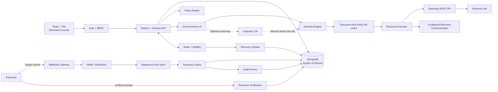

# RazCodePay Architecture

**Razorpay AI Buildathon · Track 03**

## 1. Product and system boundary

RazCodePay is an AI-assisted revenue recovery control plane for merchants using Razorpay. It turns a failed payment event into an auditable decision and recovery workflow.

The core loop is:

**detect → diagnose → predict → decide → policy-check → execute → verify**

The authority boundary is intentionally strict:

> **AI recommends. Deterministic policy controls. Executor acts. Razorpay verifies.**

The implementation is provider-grounded: application state lives in MongoDB, background work is asynchronous through Redis/BullMQ, and recovered revenue is credited only from verified Razorpay success events.

## 2. High-level architecture



## 3. Component responsibilities

### React/Vite merchant console

The web application provides the merchant-facing command center, recovery queue, decision intelligence view, policy/controls view, operations panel and account/profile controls.

The UI is a presentation and orchestration surface. It does not contain provider secrets and it cannot bypass server-side policy checks.

### Express API

The API owns:

- authentication and authorization
- merchant-scoped data access
- webhook ingestion
- case lifecycle operations
- policy evaluation
- AI/ML orchestration
- provider actions
- audit and communication history

### MongoDB

MongoDB is the **application system of record**. The main persisted domains are:

- merchants
- users
- Razorpay connections
- recovery cases
- webhook events
- audit events
- experiments
- recovery outcomes
- communication events

Redis is not used as the business database.

### Redis + BullMQ

Redis/BullMQ is infrastructure for asynchronous work such as delayed evaluation, retries and worker execution. Jobs are disposable orchestration state; durable business state remains in MongoDB.

The worker is intentionally separate from the HTTP API so recovery work can continue without keeping a browser session open.

### Razorpay adapter

The provider adapter isolates Razorpay-specific API calls and credential handling from the recovery engine. The implemented provider action is Payment Link creation for eligible cases.

Provider success remains an external truth boundary: creating a Payment Link never directly marks a case as recovered.

## 4. Authentication and merchant isolation

Production mode follows:

```text
Registration / Login
        ↓
JWT access token
        ↓
Merchant identity + role
        ↓
Merchant-scoped API queries
        ↓
MongoDB
```

Roles currently supported:

- `owner`
- `admin`
- `operator`
- `viewer`

Passwords are bcrypt-hashed. Provider credentials are encrypted before persistence. The frontend profile menu can terminate the local merchant session by removing the access token and returning to the authentication gate.

## 5. Event ingestion and verification

The Razorpay webhook path is:

```text
Razorpay event
    ↓
merchant-specific webhook route
    ↓
raw-body HMAC verification
    ↓
duplicate-event check
    ↓
MongoDB webhook event record
    ↓
recovery case correlation
    ↓
AI + policy pipeline
```

The route is:

```text
POST /api/webhooks/razorpay/<merchantId>
```

The implementation validates the signature over the raw request body before trusting the event. When a provider event ID is available it is used for deduplication; otherwise a deterministic event hash provides a fallback.

Only verified events are allowed to influence recovery state.

## 6. Recovery case state machine

```text
DETECTED
   ↓
ENRICHED
   ↓
AWAITING_WINDOW
   ↓
PLANNED
   ↓
EXECUTING
   ↓
MONITORING ───────────────► RECOVERED
   │
   ├───────────────────────► STOPPED
   └───────────────────────► EXPIRED
```

A case may wait because of merchant policy, including a grace period or quiet hours.

**`recovered` is a provider-confirmed state.** A model recommendation, outbound message or created Payment Link is not sufficient.

## 7. AI and decision pipeline

### 7.1 Feature construction

The local model uses provider and case context including:

- failure-code prior
- recovery-type prior
- event freshness
- customer intent
- customer contact reachability
- communication consent
- amount opportunity
- provider-context completeness
- previous-attempt pressure

### 7.2 Local recovery model

`server/src/ai/riskModel.js` implements `local-recovery-v2` as a deterministic, interpretable scoring model.

The model returns:

```text
riskScore
recoverabilityScore
expectedRecoveryMinor
confidence
uncertainty
dataQuality
modelVersion
feature signals
```

`expectedRecoveryMinor` is an opportunity estimate used for ranking; it is not an accounting value and is never treated as actual recovered revenue.

The repository does not claim to be trained on proprietary production labels. The model is deliberately deterministic and inspectable for the buildathon.

### 7.3 Decision engine

The decision layer maps the current case to a bounded action set such as:

- `wait`
- `send_payment_reminder`
- `create_payment_link`
- `request_payment_method_update`
- `create_human_task`
- `stop_case`

The available set is first restricted by policy. The local decision engine then chooses a recommendation using recovery potential, value and safety conditions.

### 7.4 Optional LLM reasoning

An LLM can provide structured reasoning when `AI_API_KEY` is configured. It receives normalized case facts and the action set already allowed by policy.

The LLM is not a provider credential holder and is not authorized to invent arbitrary operations, discounts, links, deadlines or customer facts.

If the LLM fails or returns an invalid action, the deterministic local decision remains authoritative.

## 8. Policy and guardrails

Merchant policy exists outside the model. Relevant constraints include:

- recovery window
- grace period
- quiet hours
- maximum attempts per case
- automatic-contact cap
- human-approval threshold
- allowed communication channels
- terminal case state
- consent requirements

The same principle is enforced twice:

```text
Case arrives
    ↓
Policy pre-filter
    ↓
AI / decisioning
    ↓
Policy re-check
    ↓
Provider or communication side effect
```

The second check is essential because policy or case state may have changed after planning.

## 9. Recovery execution

For an eligible case the executor can:

1. Re-load current case state.
2. Re-evaluate current merchant policy.
3. Validate that the requested action is allowed.
4. Apply an idempotent operation key.
5. Perform the provider/communication side effect.
6. Persist the attempt and provider reference.
7. Move the case into a state that waits for provider confirmation.

For Payment Link recovery, the provider reference is stored on the case. The system deliberately does not translate “Payment Link created” into “money recovered.”

## 10. Recovery verification

The verification path is:

```text
Razorpay success event
        ↓
HMAC verification
        ↓
Event deduplication
        ↓
Case / provider correlation
        ↓
Recovery outcome
        ↓
Recovered amount attribution
        ↓
Case = RECOVERED
```

This protects the business metric from false positives caused by clicks, emails, created links or model predictions.

## 11. Idempotency and consistency

Important protections include:

- merchant-scoped uniqueness
- provider event deduplication
- deterministic action idempotency keys
- terminal-state checks
- current-state reload before side effects
- execution-time policy re-check
- persisted processing status for webhook events
- retry/backoff through BullMQ for asynchronous work

The objective is to make repeated provider deliveries and worker retries safe and observable.

## 12. Auditability

Significant operations produce audit data containing the merchant context, actor information when available, case identity, event/action type, decision context, provider reference and timestamp.

Communication events and verified recovery outcomes are persisted separately so operators can inspect the complete lifecycle of a case.

## 13. Demo and production-oriented modes

### Demo mode

`DEMO_MODE=true`

- synthetic merchant workspace
- no provider secrets required
- synthetic recovery cases
- no provider side effects
- demo success simulation available

### Production-oriented mode

`DEMO_MODE=false`

- MongoDB required
- authentication and RBAC enforced
- merchant credentials encrypted before storage
- signed provider webhooks required
- synthetic demo reset/success endpoints blocked
- real Razorpay Payment Link creation available for eligible cases

## 14. Failure handling

| Failure or condition | Expected behavior |
|---|---|
| LLM unavailable | fall back to deterministic local decisioning |
| LLM returns invalid action | ignore invalid output and retain safe decision |
| missing consent | block customer contact |
| quiet hours | delay / wait |
| grace period active | delay / wait |
| attempt limit reached | stop further automated attempts |
| high-value / uncertain case | route toward human review when applicable |
| duplicate provider event | idempotent no-op / previously processed path |
| invalid webhook signature | reject |
| provider API error | persist failure and leave state observable for retry/review |
| verified success event | attribute recovery and close eligible case |

## 15. Current implementation boundary

The repository demonstrates the complete control-plane workflow in a safe local/Test Mode environment. It should be described as **production-oriented**, not as a fully operated public SaaS.

A public Live Mode deployment would additionally require managed infrastructure, backups, centralized observability, secret rotation, formal security testing, messaging delivery/bounce infrastructure, model calibration against sufficient production outcomes, and completion of any Razorpay Technology Partner/OAuth onboarding required by the intended multi-merchant business model.
