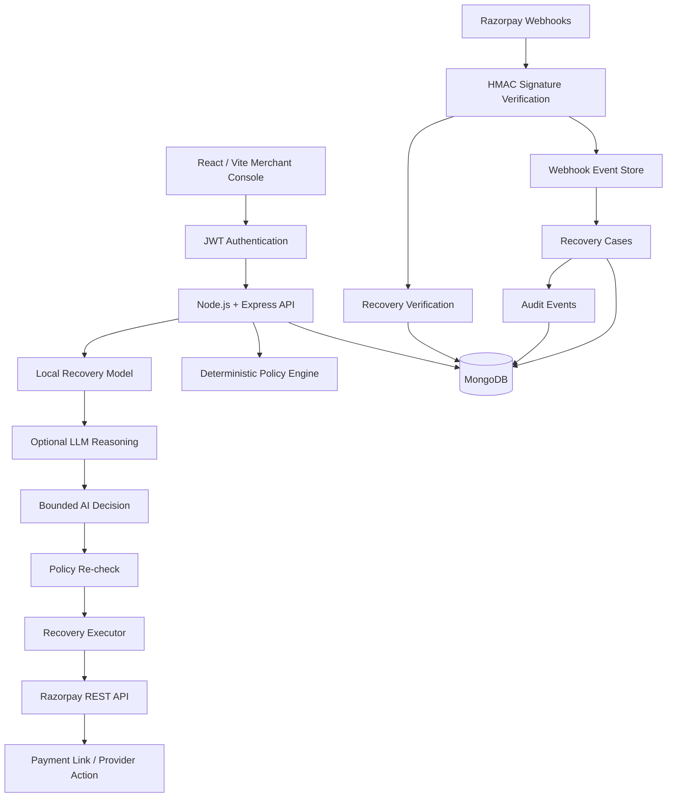

# RazCodePay Architecture — Real-World Track 03 Platform

## 1. Objective

RazCodePay is an AI-assisted revenue recovery control plane for merchants using Razorpay. It detects payment failures, predicts recovery potential, recommends a bounded intervention, performs only policy-approved actions, and attributes recovered money only after verified Razorpay success.

The core loop is:

**detect → diagnose → predict → choose → policy-check → execute → verify → learn**

The authority boundary is deliberately strict:

**AI recommends. Deterministic policy authorizes. Executor acts. Razorpay verifies.**

## 2. Production architecture



## 3. Components

### Frontend

React + Vite runs on port `5173` locally. Production mode starts with authentication, then merchant onboarding, then the recovery console.

### API

Node.js + Express runs on port `3000`. The API owns merchant authorization, policy evaluation, AI orchestration, execution and provider integration.

### MongoDB

MongoDB is the only application database. Production collections are:

- `merchants`
- `users`
- `razorpayconnections`
- `recoverycases`
- `webhookevents`
- `audit_events`

Unique indexes and merchant-scoped indexes protect correlation and query behavior.

### AI

The local model produces risk/recoverability predictions and feature signals. Optional LLM reasoning is constrained to a pre-approved action list and cannot access provider credentials.

### Razorpay

A dedicated adapter talks to the Razorpay REST API using merchant credentials. The production executor can create a Payment Link for an eligible case. Provider success is still verified through a signed webhook before recovery is recorded.

## 4. Merchant identity and security

Demo mode uses a synthetic merchant workspace. Production mode uses:

```text
signup/login
   ↓
JWT access token
   ↓
merchantId + role claims
   ↓
merchant-scoped queries
```

Roles:

- owner
- admin
- operator
- viewer

Passwords are hashed with bcrypt. Provider secrets are encrypted with AES-256-GCM before MongoDB storage. The browser never receives the provider secret.

For a true multi-merchant Razorpay Technology Partner SaaS, the long-term onboarding mechanism should use Razorpay OAuth rather than collecting merchant API secrets directly.

## 5. Event ingestion

The webhook receiver accepts the raw request body, verifies the HMAC-SHA256 signature before parsing JSON, records the provider event, deduplicates it, and passes only verified events into the recovery engine.

The merchant-specific route is:

```text
POST /api/webhooks/razorpay/<merchantId>
```

`x-razorpay-event-id` is used when available; otherwise a deterministic event hash is used as a deduplication key.

## 6. Recovery case lifecycle

```text
DETECTED
   ↓
ENRICHED
   ↓
AWAITING_WINDOW
   ↓
PLANNED
   ↓
EXECUTING
   ↓
MONITORING ─────────► RECOVERED
   │
   ├────────────────► STOPPED
   └────────────────► EXPIRED
```

Only verified provider success can transition an active case to `recovered`.

## 7. AI decision pipeline

### Step 1 — predictive model

Input features include:

- amount exposure
- failure profile
- event freshness
- customer intent
- communication consent
- previous attempts

Output:

```json
{
  "riskScore": 0.61,
  "recoverabilityScore": 0.83,
  "modelVersion": "local-recovery-v1",
  "signals": []
}
```

### Step 2 — policy pre-filter

The policy engine removes actions blocked by:

- missing consent
- quiet hours
- amount limits
- recovery-window expiry
- maximum attempts
- terminal state

### Step 3 — bounded AI recommendation

The local model chooses an action from the remaining set. If an LLM is configured, it can refine the recommendation and explanation, but cannot create or authorize an action outside the allow-list.

### Step 4 — execution-time policy check

The executor fetches the current case and evaluates the policy again immediately before the side effect.

## 8. Real recovery actions

Available action types include:

- wait
- send payment reminder (test-mode transport)
- create Razorpay Payment Link (production provider action)
- request payment-method update
- create human task
- stop case

A real Payment Link action records the provider reference and link URL but does not declare recovery. Recovery requires a later successful provider event.

## 9. Idempotency and consistency

The platform protects important boundaries with:

- unique case keys per merchant
- unique provider event deduplication keys
- deterministic recovery action idempotency keys
- terminal-state checks
- merchant-scoped database queries
- policy re-check immediately before action

Webhook records also retain processing state: `received`, `processed`, `ignored`, or `failed`.

## 10. Auditability

Every significant event records:

- merchant
- actor type
- actor identity when available
- case
- event name
- policy/AI decision details
- provider reference
- timestamp

This makes the system explainable to operators and suitable for post-incident review.

## 11. Configuration boundaries

### Demo

`DEMO_MODE=true`

- no authentication required
- no MongoDB required
- synthetic cases enabled
- no live provider API calls
- success simulator enabled

### Production

`DEMO_MODE=false`

- MongoDB required
- authentication required
- RBAC required
- synthetic endpoints disabled
- merchant credentials encrypted
- merchant webhook secret verified
- real provider actions available

## 12. Failure behavior

| Failure | Behavior |
|---|---|
| LLM unavailable | local model continues |
| invalid LLM response | deterministic local decision remains |
| no consent | no customer contact |
| quiet hours | wait |
| amount threshold | human review |
| duplicate webhook | no-op |
| invalid webhook | reject |
| provider API failure | record error, keep case active/retry according to future queue policy |
| success event | case becomes recovered |
| demo endpoint in production | reject |

## 13. Current production boundary

This repository is now production-oriented rather than purely synthetic, but public SaaS launch still requires operational infrastructure outside the source tree: managed MongoDB backups, HTTPS, centralized logging/metrics, secret rotation, penetration testing, a real messaging provider for customer reminders, and Razorpay Technology Partner/OAuth onboarding for a multi-merchant platform.

The source code intentionally keeps a safe local demo because a production platform should remain easy to demonstrate without giving the demo any authority over real customer money.
