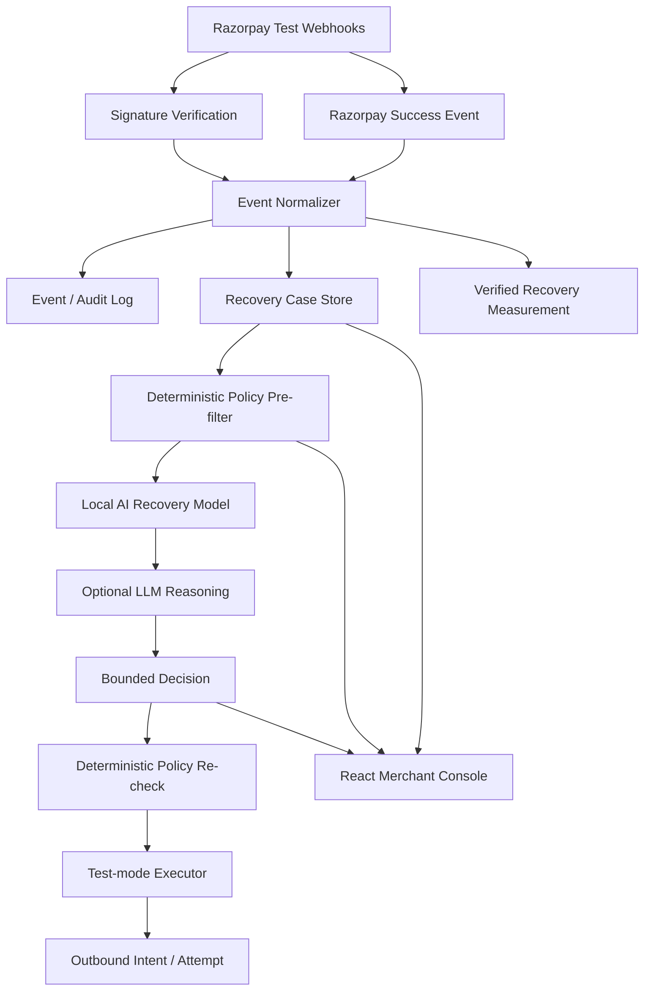

# RazCodePay Architecture — Track 03 AI Revenue Recovery

## 1. Objective

Build an AI-assisted revenue recovery system for payment failures, overdue invoices, and selected checkout abandonment signals.

The closed loop is:

**detect → diagnose → choose → execute bounded intervention → measure verified recovery**

The design is intentionally conservative: AI recommends; deterministic policy authorizes; the executor performs; provider success verifies.

## 2. Product thesis

Merchants lose revenue after a payment failure not because the payment is always unrecoverable, but because the next best action is often delayed, repetitive, or not prioritized.

RazCodePay creates a merchant control plane that answers:

- Which money is currently at risk?
- Which cases have the strongest recovery potential?
- Why is a specific action recommended?
- Is that action actually permitted right now?
- Did the provider later confirm payment success?

## 3. MVP scope

### In scope

- failed subscription payments
- overdue/issued invoices
- checkout abandonment as synthetic phase-2 data
- signed Razorpay webhook ingestion
- immutable event/audit intent
- recovery case correlation
- local risk/recoverability model
- optional LLM reasoning
- deterministic policy engine
- idempotent test-mode executor
- recovery measurement from provider success
- merchant dashboard

### Out of scope for the MVP

- live customer messaging
- automatic discounts
- autonomous refunds
- autonomous payment-method modification
- production multi-user authentication

## 4. Architecture



## 5. AI design

RazCodePay deliberately separates intelligence from authority.

### Layer A — local recovery model

A small interpretable model combines:

- failure recoverability prior
- event freshness
- customer intent signal
- consent availability
- amount exposure
- previous-attempt pressure

It returns:

```json
{
  "riskScore": 0.72,
  "recoverabilityScore": 0.84,
  "modelVersion": "local-recovery-v1",
  "signals": []
}
```

### Layer B — optional LLM reasoning

The LLM receives only normalized case facts, numeric scores, and the policy-approved action list. It returns structured JSON containing the selected action, confidence, reason codes, and explanation.

The LLM cannot:

- invent a new action
- create a discount
- create a payment link
- override a consent rule
- mark revenue recovered
- access provider credentials

If the LLM fails, the local model remains usable.

## 6. Policy engine

Business limits are deterministic and testable.

Default demo policy:

| Guardrail | Default |
|---|---:|
| Recovery window | 168 hours |
| Quiet hours | 21:00–09:00 |
| Max attempts / case | 2 |
| Automatic contact cap | ₹5,000 |
| Human approval threshold | ₹1,000 |
| Email | enabled |
| SMS | disabled |
| WhatsApp | disabled |

The implementation performs a second policy evaluation immediately before an outbound action.

## 7. Case state machine

```text
DETECTED / ENRICHED
       │
       ▼
AWAITING_WINDOW
       │
       ▼
PLANNED ───────► EXECUTING ───────► MONITORING
  │                  │                   │
  │                  │                   ├──► RECOVERED
  │                  └──► STOPPED        │
  │                                      └──► EXPIRED
  └────────────────────────────────────────► STOPPED
```

A provider success event is the authoritative transition to `recovered`.

## 8. Razorpay integration

Razorpay webhook signatures are HMAC-SHA256 values computed using the webhook secret and the raw request body. Razorpay also documents `x-razorpay-event-id` as a unique event identifier suitable for de-duplication. citeturn540502search2

The receiver therefore:

1. reads the raw request bytes;
2. validates `X-Razorpay-Signature`;
3. uses `x-razorpay-event-id` when present;
4. parses only after signature validation;
5. normalizes the provider payload;
6. creates/updates a recovery case;
7. separately consumes success events.

Payment events used by the MVP include `payment.failed` and `payment.captured`; `order.paid` is also a paid-order signal. citeturn540502search1

## 9. Measurement and attribution

The core metric is verified recovered amount:

```text
recovered_amount = Σ provider-confirmed successful payments
```

The dashboard also shows:

- revenue at risk
- active cases
- recovered cases
- case recovery rate
- outbound attempts
- estimated operator hours saved

The system intentionally does not treat “message sent” as “money recovered”.

## 10. Demo persistence strategy

The local demo uses an in-memory store so infrastructure failures do not blank the UI.

MongoDB remains an optional persistence path documented for the next hardening phase. A production version should replace the demo store with durable collections for incoming events, recovery cases, outbound attempts, and audit logs while keeping the same domain interfaces.

## 11. Security and privacy

- webhook signature verification before JSON parsing
- constant-time signature comparison
- no secrets in frontend code
- merchant-scoped API headers in the demo boundary
- AI receives minimized normalized case context
- provider credentials remain outside AI context
- no live messaging in the demo executor
- explicit test mode

## 12. Failure modes and fail-safe behavior

| Failure | Expected behavior |
|---|---|
| missing AI key | local AI model continues |
| LLM timeout/invalid JSON | local AI recommendation remains |
| missing consent | no customer contact |
| quiet hours | wait |
| high-value case | human review |
| duplicate webhook | idempotent no-op |
| invalid webhook signature | reject |
| payment success | close case |
| terminal case | block automation |
| API unavailable | UI can show safe local demo state |

## 13. Repository structure

```text
server/src/ai             local intelligence
server/src/services       policy, decisioning, execution, recovery
server/src/routes         API surface
server/src/store.js       demo operational store
server/test               automated policy/AI checks
web/src                   React recovery console
docs                      API, AI and demo runbook
```

## 14. Production hardening roadmap

1. durable MongoDB collections + unique indexes
2. merchant authentication and role-based access
3. real email/SMS provider adapters
4. model training from merchant-labeled recovery outcomes
5. feature store + model monitoring
6. queue-backed execution with distributed locks
7. configurable per-merchant policies
8. signed deployment secrets and audit retention
9. experiment framework for recovery treatment measurement
10. live Razorpay Test Mode integration end-to-end

## 15. Design decisions

**Why not let the LLM make the final decision?** Financial automation needs predictable business boundaries.

**Why a local model?** Judges can inspect and run it without an API key, while it remains a genuine scoring layer rather than static mock text.

**Why keep a demo store?** The business demo should start reliably even when MongoDB is not installed.

**Why test-mode execution?** The project can demonstrate the execution path without risking real customer communication.
