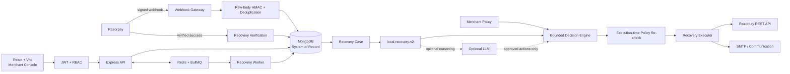

# RazCodePay Architecture

**Razorpay AI Buildathon · Track 03**

## 1. System purpose

RazCodePay is an AI-assisted revenue recovery control plane for merchants using Razorpay. A failed payment becomes a recovery case, an explainable decision, a policy-bounded action, and finally a provider-verified outcome.

The system loop is:

**detect → diagnose → predict → decide → policy-check → execute → verify**

The trust boundary is intentionally strict:

> **AI recommends. Policy controls. Executor acts. Razorpay verifies.**

MongoDB stores durable application state. Redis/BullMQ provides asynchronous job infrastructure. Razorpay success events remain the monetary source of truth for recovered revenue.

## 2. High-level architecture



## 3. Component responsibilities

### React/Vite merchant console

The web console provides the merchant-facing Command Center, Recovery Cases, Decision Intelligence, Policy & Controls, Operations, and account/profile controls.

The UI is not an authorization boundary. Provider secrets are never rendered, and all important policy and execution checks happen on the server.

### Express API

The API owns authentication, merchant-scoped access, case lifecycle operations, policy evaluation, AI orchestration, provider actions, audit data, communications, experiments and operational endpoints.

### MongoDB

MongoDB is the durable application system of record. Persisted domains include merchants, users, Razorpay connections, recovery cases, webhook events, audit events, experiments, communication events and recovery outcomes.

Redis is not used as the business database.

### Redis + BullMQ

Redis/BullMQ handles delayed evaluation, retries and worker execution. Job state is disposable orchestration state; business state must remain recoverable from MongoDB and verified provider events.

### Razorpay integration

The provider layer isolates credential handling and Razorpay REST operations from the recovery engine. Eligible cases can create a real Razorpay Payment Link in provider-connected Test Mode/controlled deployments.

Creating a Payment Link does not mark a case recovered. A verified success event is required.

## 4. Authentication and merchant isolation

Production-oriented mode follows:

```text
Registration / Login
        ↓
JWT access token
        ↓
Merchant identity + role
        ↓
Merchant-scoped API access
        ↓
MongoDB
```

Roles:

```text
owner · admin · operator · viewer
```

Passwords are bcrypt-hashed. Provider secrets are encrypted before persistence. The Profile menu exposes account state and a local sign-out control that clears the browser session and returns to the authentication gate.

## 5. Razorpay webhook ingestion

```text
Razorpay event
      ↓
merchant-specific route
      ↓
raw-body HMAC verification
      ↓
deduplication
      ↓
persist webhook event
      ↓
correlate/create recovery case
      ↓
schedule recovery evaluation
```

Route:

```text
POST /api/webhooks/razorpay/<merchant-id>
```

The implementation validates the signature over the raw request body. When a provider event ID is available it is used for deduplication; a deterministic payload hash is retained as fallback identity material.

## 6. Recovery case lifecycle

```text
DETECTED
   ↓
ENRICHED
   ↓
AWAITING_WINDOW
   ↓
PLANNED
   ↓
EXECUTING
   ↓
MONITORING ─────────► RECOVERED
   │
   ├─────────────────► STOPPED
   └─────────────────► EXPIRED
```

A case can remain in `awaiting_window` because of the merchant grace period, quiet hours or another policy-controlled timing boundary.

`recovered` is reserved for provider-confirmed outcomes.

## 7. AI and decisioning

### 7.1 Local model

`server/src/ai/riskModel.js` implements `local-recovery-v2` as a deterministic and interpretable scoring model.

It considers signals such as failure profile, recovery type, event freshness, customer intent, reachability, consent, amount opportunity, provider-context completeness and previous-attempt pressure.

Outputs include:

```text
riskScore
recoverabilityScore
expectedRecoveryMinor
confidence
uncertainty
dataQuality
modelVersion
features
signals
```

`expectedRecoveryMinor` is an opportunity estimate used for prioritization. It is not recovered money.

### 7.2 Bounded decision engine

The decision engine evaluates only policy-approved actions:

```text
wait
send_payment_reminder
create_payment_link
request_payment_method_update
create_human_task
stop_case
```

Failure evidence can steer eligible cases toward payment-method update instead of a generic reminder. High-value or uncertain cases can be routed to human review.

### 7.3 Optional LLM

When configured, the LLM receives normalized case facts and the already approved action set. It cannot invent provider operations, discounts, links, deadlines, customer facts or disallowed actions.

Invalid or unavailable LLM output falls back to the deterministic local decision.

## 8. Policy enforcement

Merchant policy is independent from the AI model. Relevant controls include:

- recovery window
- grace period
- quiet hours
- maximum attempts
- automatic-contact cap
- human-approval threshold
- allowed communication channels
- consent
- terminal case state

The policy is enforced twice:

```text
case enters pipeline
      ↓
policy pre-filter
      ↓
AI / decisioning
      ↓
execution-time policy re-check
      ↓
side effect
```

The second check prevents a stale plan from bypassing a policy or case-state change that happened after planning.

## 9. Execution

For an eligible action, the executor:

1. reloads the current case
2. reloads current merchant policy
3. verifies that the requested action is still allowed
4. creates an idempotent operation identity
5. performs the provider/communication side effect
6. persists attempt status and provider/communication references
7. leaves the case waiting for the provider outcome where applicable

## 10. Provider-grounded recovery verification

```text
Recovery action / Payment Link
            ↓
customer completes payment
            ↓
verified Razorpay success event
            ↓
provider/case correlation
            ↓
RecoveryOutcome
            ↓
recoveredAmountMinor attributed
            ↓
case = recovered
```

A recommendation, email, click, Payment Link creation, or API acknowledgement is never treated as revenue recovered on its own.

## 11. Idempotency and consistency

The system uses:

- merchant-scoped unique case keys
- provider event deduplication
- idempotent action keys
- terminal-state checks
- current-state reload before side effects
- execution-time policy re-check
- persisted webhook processing status
- BullMQ retries/backoff for asynchronous work

The goal is safe behavior under repeated webhook deliveries, UI retries and worker retries.

## 12. Auditability

Important provider, policy, decision, execution and recovery events are written to the audit trail. Communication events and recovery outcomes are persisted independently so the complete recovery lifecycle can be inspected.

## 13. Demo and production-oriented modes

### Demo mode

`DEMO_MODE=true` provides a synthetic merchant workspace, synthetic recovery data, no provider credentials, no live provider calls and demo-only state simulation/reset endpoints.

### Production-oriented mode

`DEMO_MODE=false` requires MongoDB, authentication/RBAC, merchant-scoped access, encrypted provider credentials and signed Razorpay webhooks. Demo mutation endpoints are blocked, while real provider actions are available where configured.

## 14. Operational failure behavior

| Condition | Behavior |
|---|---|
| Invalid webhook signature | Reject before recovery state change |
| Duplicate provider event | Idempotent duplicate path |
| Missing consent | Customer contact blocked |
| Quiet hours / grace period | Case waits |
| Attempt limit | Further automation blocked |
| High value / high uncertainty | Human-review boundary can apply |
| LLM unavailable/invalid | Local deterministic decision retained |
| Provider action failure | Attempt/error remains observable for review/retry |
| Verified provider success | Recovered amount attributed and case closed |

## 15. Final implementation boundary

The buildathon repository demonstrates the end-to-end recovery control plane locally and in Razorpay Test Mode. It is **production-oriented**, not presented as an already-operated public Live Mode SaaS.

A Live Mode launch would still require managed infrastructure, backups, centralized observability, secret rotation, formal security testing, messaging delivery/bounce handling, sufficient outcome-based model calibration and the appropriate Razorpay partner/OAuth onboarding for the intended multi-merchant operating model.